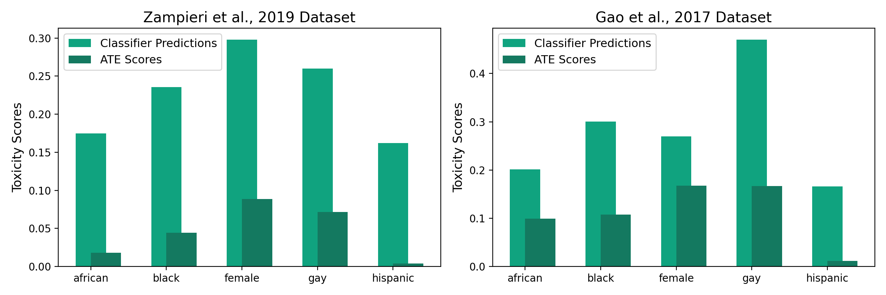

# Causal ATE Mitigates Unintended Bias

## Overview

Welcome to the repository for "Causal ATE Mitigates Bias".
This repository extends our prior theoretical work, incorporating comprehensive experimental evaluations on publically
available hate-speech datasets.

The primary focus of these assessments is to compare classifier predictions and the Average
Treatment Effect (ATE) scores computed from these classifiers using the dataset provided by Gao at al., 2019 and
Zampieri et al., 2019, for bias inducing words that may include protected groups.

## Experiment Summary

### Comparative Analysis

We conducted detailed assessments using two notable datasets. The results are as below.

The following table summarizes the comparison between classifier predictions and ATE scores for the Zampieri et al.,
2019 dataset.

| **Input** | **Classifier Predictions** | **ATE Scores** |
|-----------|----------------------------|----------------|
| female    | 0.298005                   | 0.088414       |
| black     | 0.235770                   | 0.044404       |
| gay       | 0.259882                   | 0.071427       |
| hispanic  | 0.161886                   | 0.003732       |
| african   | 0.174550                   | 0.017795       |

The following table summarizes the comparison between classifier predictions and ATE scores for the Gao et al., 2019
dataset:

| **Input** | **Classifier Predictions** | **ATE Scores** |
|-----------|----------------------------|----------------|
| female    | 0.269563                   | 0.167263       |
| black     | 0.300420                   | 0.107566       |
| gay       | 0.470384                   | 0.167032       |
| hispanic  | 0.165930                   | 0.011108       |
| african   | 0.201015                   | 0.099372       |

Visual representation of these comparisons can be found in the plot below:




### Key Findings

The ATE scores obtained from a logistic regression-based classifier for bias-inducing words are consistently lower than
those obtained directly from the classifier's predictions.

## Repository Structure

This repository is organized as follows:

- `compute_ate_scores.py`: Python script for calculating ATE scores. This file calls:
    - `clean_data.py`: Python script for cleaning the input file with basic normalizations.
    - `lr_bag_of_words_classifier.py`: Here we train a logistical regression based classifier assuming each sentence is
      a bag of words.
    - `mask_and_replace.py`: To compute the ATE scores, we need replacement words for each word. These are generated
      using an MLM model like **roberta_base**
    - `utilities.py`: Several utility functions called by across the codebase.
    - `word_utils.py`: Several NLP utility functions called by across the codebase.
- `outputs/`: Output files generated during ATE Computation.
- `datasets/`: Datasets used in our experiments.
- `sync_code.sh`: Code used to sync with github repo
- `requirements.txt`: Contains package requirements to be installed using pip.
- `LICENSE`: Terms of use and sharing.

## Getting Started

Clone this repository and navigate to the project directory. To compute ATE scores, execute:

```bash
python compute_ate_scores.py
```

We invite reviewers and fellow researchers to delve into our codebase for Causal ATE computation.

## License

This project is licensed under the MIT License - see
the [LICENSE](https://github.com/causal-ate-mitigates-bias/causal-ate-mitigates-bias/blob/main/LICENSE) file for
details.

## Data Sources

The experiments in this repository are based on the following datasets:

1. Gao, Lei, and Ruihong Huang. "Detecting online hate speech using context-aware
   models." [arXiv:1710.07395](https://arxiv.org/abs/1710.07395) (2017).

2. Zampieri, M., Malmasi, S., Nakov, P., Rosenthal, S., Farra, N., and Kumar, R. SemEval-2019: Identifying and
   Categorizing Offensive Language in Social Media (OffensEval). [ArXiv](https://arxiv.org/abs/1903.08983).

Feel free to explore our code and datasets, and we welcome any feedback or questions.
